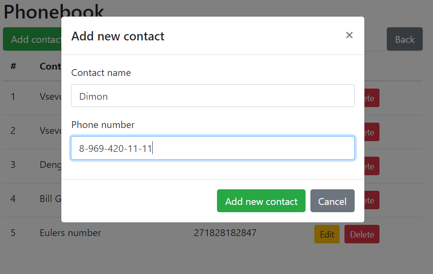
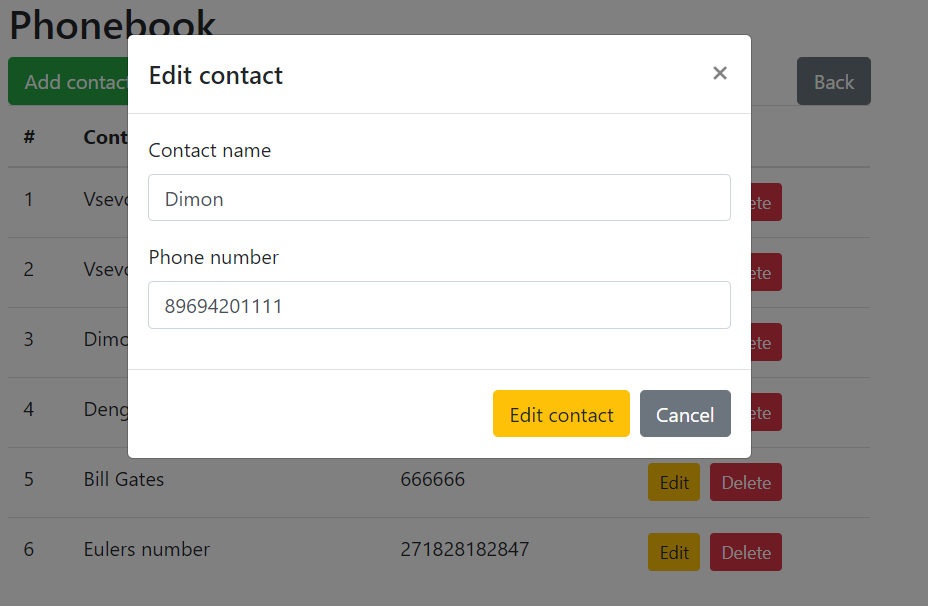
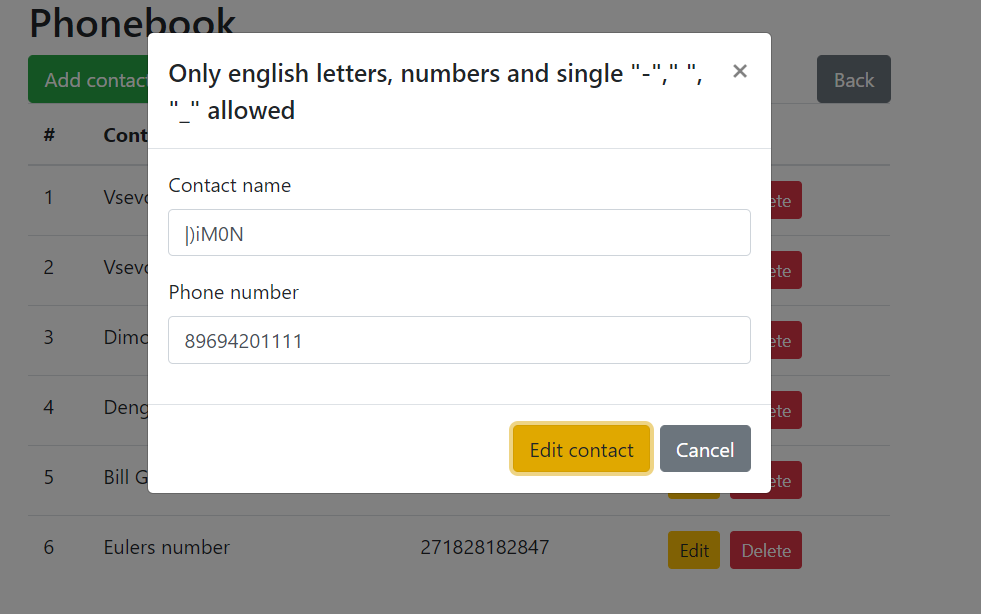
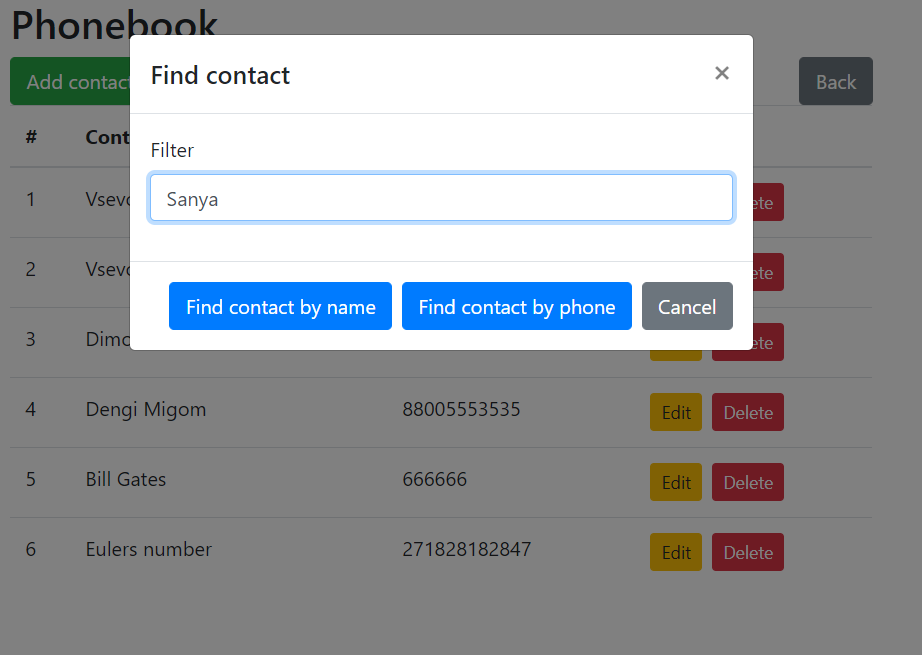
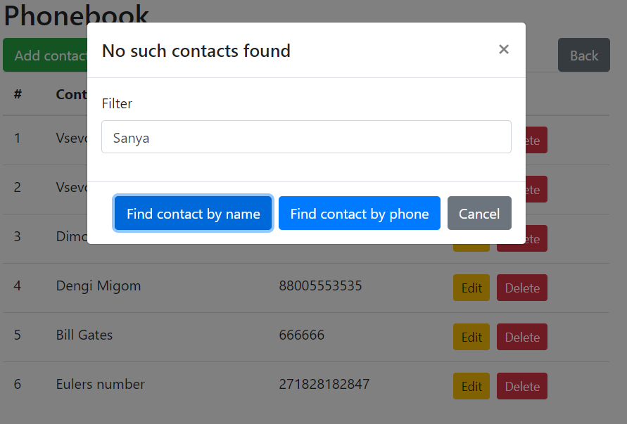
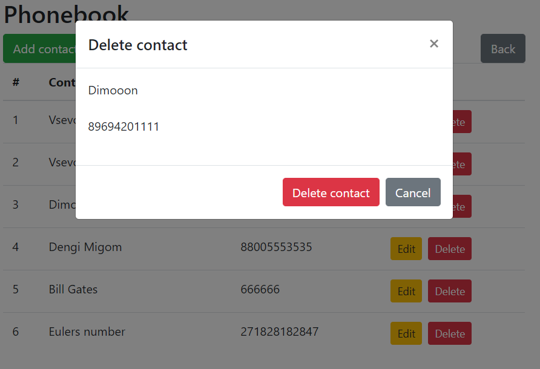

<h1>Тестовое задание Naumen (Scala)</h1>
<h3>Используемые технологии: React</h3>
<h3> клиентское веб-приложение, которое работает с API бекенда:</h3>
https://github.com/vsevolod66rus/naumen-test-scala
<h3>Использование:</h3>

<code>git clone https://github.com/vsevolod66rus/naumen-test-frontend.git</code>

в директории проекта через консоль установить npm и запустить проект:

<code>npm install</code>

<code>npm start</code>

после старта откроется веб-интерфейс:

<code>http://localhost:3000</code>

<h3>Главная страница:</h3>
 

 
 
<h2>Сценарии использования</h2> 

<h3>Модальное окно добавления контакта:</h3>
 

<h3>Модальное окно редактирования контакта:</h3>
 
 

<h3>Сообщение об ошибке при прохождении валидации:</h3>
 
 

<h3>Модальное окно поиска контактов:</h3>
 

<h3>Сообщение в случае, когда в книге нет контактов по заданному фильтру:</h3>
 

<h3>Модальное окно удаления контакта из справочника:</h3>
 
  